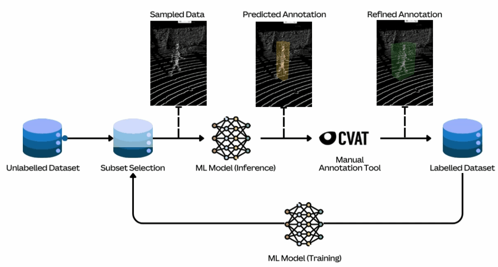

# :toolbox: Machine Learning-Assisted Data Annotation (ML-ADA) for 3D/2D Object Detection with Active Learning
ML-ADA is a semi-automatic data annotation tool that uses machine learning (ML) models to pre-annotate data. Simultaneously, it actively fine-tunes the models with the refined annotations the user provides. Currently, ML-ADA supports:

- :mag:	3D/2D object detection
- :dart: confidence-based sampling strategy for active learning
- :card_file_box: Kitti and OpenLabel data annotation formats
- :eyes: Yolov3 and Pointpillar networks as object detectors
- :arrows_counterclockwise:	API-based integration with [CVAT.ai](https://app.cvat.ai).




## :bookmark_tabs: **Table of Contents**
- [Installation](#installation)
- [Usage](#usage)
- [Configuration Guide](#configuration-guide)
- [Credit](#credit)
 
<!-- 
*Figure1. An overview of the ML-ADA pipeline* -->
## :gear: **Installation**
The installation has been tested on Ubuntu 22.04. 

**Step 1.** Clone the GitHub repository:

```shell
git clone https://github.com/hamedhaghighi/ML-assisted-annotation.git
```

**Step 2.** Change the current directory to the project's

```shell
cd ML-assisted-annotation
```
**Step 3.** Download and install Miniconda from the [official website](https://docs.conda.io/en/latest/miniconda.html).

**Step 4.** Create a conda environment and activate it.

```shell
conda env create -f environment.yml
conda activate mlada
```
If you encounter an error related to 'libffi.so.6' library. You can resolve it by downloading the library from this [link](https://mirrors.kernel.org/ubuntu/pool/main/libf/libffi/libffi6_3.2.1-8_amd64.deb) and then proceed to install it.
```shell
sudo apt install ./libffi6_3.2.1-8_amd64.deb
```

If you encounter an error related to Qt platform plugin "xcb", reinstall the opencv-python-headless as:

```shell
pip uninstall opencv-python-headless
pip install opencv-python-headless
```
**Step 5.** Compile ops package:
```shell
cd ops
python setup.py develop
```
## :rocket: **Usage**

Use the following steps to run the tool either on Docker or your platform:

**Step 1.** Register an account on [CVAT.ai](https://app.cvat.ai/auth/register) manual annotation tool.

**Step 2.** Create a JSON configuration file similar to the one in `config/config_3d.json`. Check the [configuration guide](#configuration-guide) for more information.

**Step 3.** Open the Terminal and activate conda.
```shell
conda activate mlada
```

**Step 4.** Run ML-ADA using the terminal.

To enable GUI, use:

```shell
python ML-ADA.py --gui
```

To enable the command line interface, use:

```shell
python ML-ADA.py --cfg CONFIG_PATH
```
In the case of GUI, either manually set the parameters or browse the config files using the "Import Config" button on the opened window.

## :wrench: **Configuration Guide**

Following is the description of each parameter in the JSON configuration file:

| Parameter | Description |
| :---        |    :----  |
| model_name | Name of the object detector model including the dataset on which the model is trained on, e.g. yolov3-coco or pointpillar-kitti. The decision to opt for a 3D or 2D annotation task is made based on the value of the model_name parameter.|
| data_dir | path to the dataset, e.g. ./data/kitti |
| data_format | format of the dataset for importing and exporting, e.g. kitti |
| exp_name | name of the current experiment, e.g. kitti_annotation |
| annotation_tool | name of the manual annotation tool, could be either "cvat_api", "cvat_manual", or "general" |
| use_cuda | true to use cuda,  false to use cpu |
| labels |  your object labels list, e.g. ["Car","Truck", "Pedestrian", "static_object"] |
| labels_to_classes | The mapping between your labels and the labels of the dataset on which the model is pre-trained, e.g. ["car", "truck", "person", -1] |

Note that the folder structure of your dataset should follow the "data_format" parameter. For instance, in the case of 3D object detection and "kitti" data format, the folder structure should look like the following:

```
[ROOTDIR]
├── velodyne
│   ├── 000000.bin
│   ├── 000001.bin
│   ├── ...
├── image_2
│   ├── 000000.png
│   ├── 000001.png
│   ├── ...
├── calib
│   ├── 000000.txt
│   ├── 000001.txt
│   ├── ...
├── label_2
│   ├── 000000.txt
│   ├── 000001.txt
│   ├── ...
```
and in the case of 2D object detection and "kitti" data format, the folder structure should look like the following:

```
[ROOTDIR]
├── image_2
│   ├── 000000.png
│   ├── 000001.png
│   ├── ...
├── label_2
│   ├── 000000.txt
│   ├── 000001.txt
│   ├── ...
```

The rest of the parameters in the config file are for advanced users and you may not need to change them. Following is the explanation of these parameters:

| Parameter | Description |
| :---        |    :----  |
| iou_thres | iou threshold required to qualify as detected by evaluation metrics, e.g. 0.5 |
| conf_thres | object confidence threshold used during the detection, e.g. 0.8  |
| nms_thres | iou threshold for non-maximum suppression used during the detection, e.g. 0.4,  |
| epochs | number of epochs for model re-training, e.g. 10 |
| batch_size | batch size that is used for model re-training, e.g. e.g. 32 |
| subset_size | number of images that are annotated during each run of the program pipeline, e.g. 100 |
| performance_thres | Re-training is discontinued when the performance reaches the performance threshold, e.g. 0.7 |
| img_size | the images are resized to img_size while feeding into the model, e.g. 416 |
| checkpoint_dir | directory for saving the current run logs, e.g. ./checkpoint |
| query_mode | method for selecting the next subset, e.g. random |
| background_training | true to enable the re-training to be run in the background,  false to disable it |
| n_cpu | number of CPU threads to be used in reading the dataset from the drive, e.g. 4 |

## :books: **Credit**

Yolov3 implementation from [packyan](https://github.com/packyan/PyTorch-YOLOv3-kitti)

Pointpillar implementation from [zhulf0804](https://github.com/zhulf0804/PointPillars)
